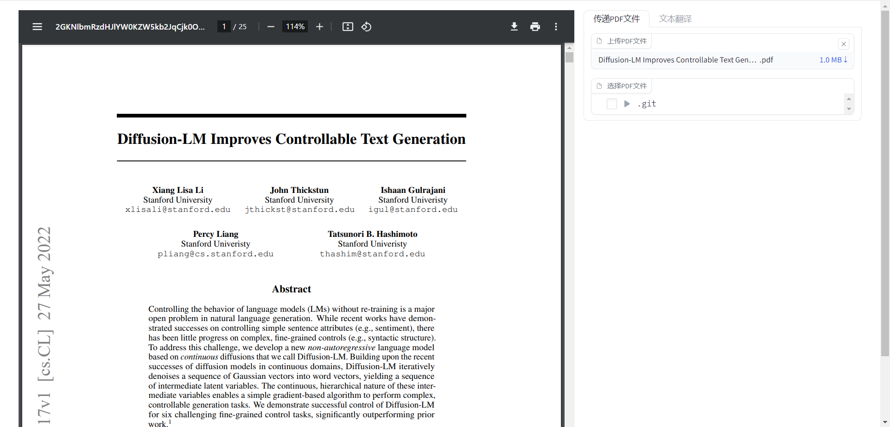
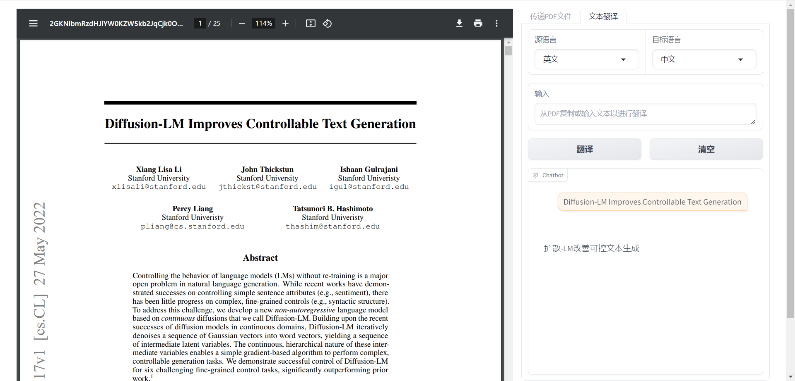

# 多功能PDF翻译器

这个Gradio应用结合了PDF显示和文本翻译功能，方便用户进行多语言文档处理。

## 主要功能

* **PDF显示:**
  * 用户可以通过上传或文件浏览器选择本地PDF文件。
  * 应用将PDF文件转换为base64编码并在iframe中显示，方便用户浏览。
* **文本翻译:**
  * 用户可以从PDF文件中复制文本或手动输入文本框进行翻译。
  * 支持中英文之间的双向翻译。
  * 用户可以选择源语言和目标语言。
  * 翻译结果以对话形式显示在聊天框中，方便用户查看历史记录。
  * 提供清空文本框和聊天框的功能。

## 使用方法

1. 上传PDF文件或使用文件浏览器选择本地PDF文件。
2. 在“文本翻译”选项卡中，选择源语言和目标语言。
3. 在文本框中输入要翻译的文本，或从PDF文件中复制文本粘贴到文本框中。
4. 点击“翻译”按钮，翻译结果将显示在聊天框中。
5. 点击“清空”按钮可以清空文本框和聊天框。

## 技术实现

* 使用`gradio`构建用户界面。
* 使用`base64`模块对PDF文件进行编码，以便在iframe中显示。
* 使用`gradio_client`调用远程机器学习模型进行文本翻译。
* 使用`chatbot`组件以对话形式展示翻译结果。

## 未来展望

* 支持更多语言的翻译。
* 实现PDF文件内容的批量翻译。
* 添加文本编辑功能，方便用户修改翻译结果。
* 支持用户自定义翻译模型。

## 界面

